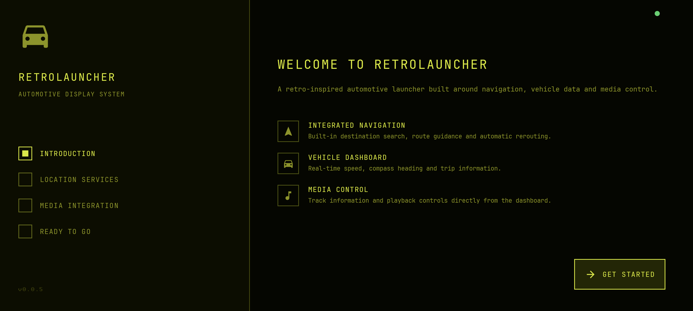
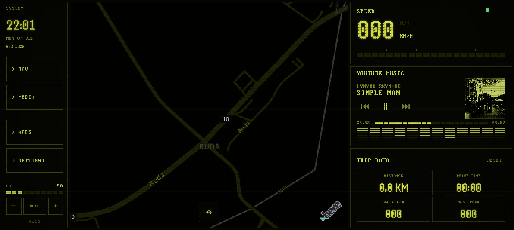
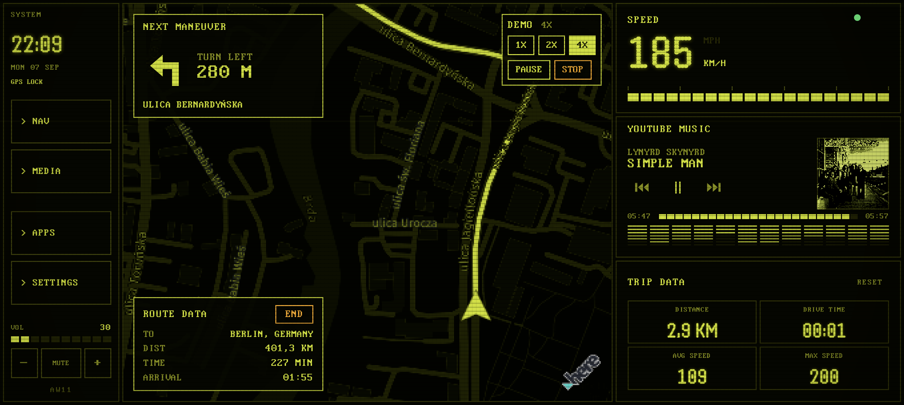
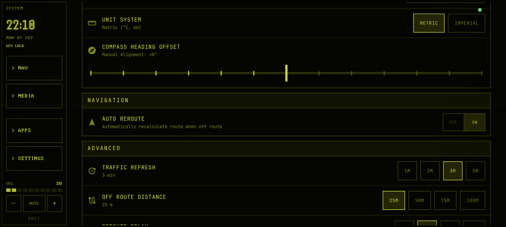

# RetroLauncher

Retro-inspired Android automotive launcher
designed for dedicated in-car tablets and head units.

### Onboarding

### Home

### Navigation

### Settings

## Features

Navigation
- HERE SDK map
- destination search
- voice destination search
- route guidance
- maneuver instructions
- automatic rerouting
- traffic-aware route refresh
- route progress / ETA

Dashboard
- GPS speedometer
- trip distance
- drive time
- average speed
- max speed
- compass

Media
- active media session
- track / artist
- play / pause
- previous / next
- progress
- media app shortcut

Interface
- fixed AW11 / 1980s LCD-inspired design
- global scanlines / pixel-display effect
- landscape automotive layout
- dedicated Apps and Settings screens

## Screenshots

### Onboarding

### Home

### Navigation

### Settings

## Requirements

- Android ...
- Landscape display
- GPS/location
- Notification access for media
- Microphone permission for voice destination search
- HERE SDK credentials

## Building

HERE_ACCESS_KEY_ID
HERE_ACCESS_KEY_SECRET

./gradlew assembleDebug

## APK availability

A prebuilt APK is not included in this release.

RetroLauncher currently requires HERE SDK credentials for navigation.
To avoid distributing shared API credentials, users should build the application from source using their own HERE credentials.

## Current limitations / roadmap

- AW11 styling for App Library
- improved MEDIA / external-app return workflow
- NAV return overlay
- background navigation / foreground service
- further device/head-unit compatibility testing

## Status

v0.1.0